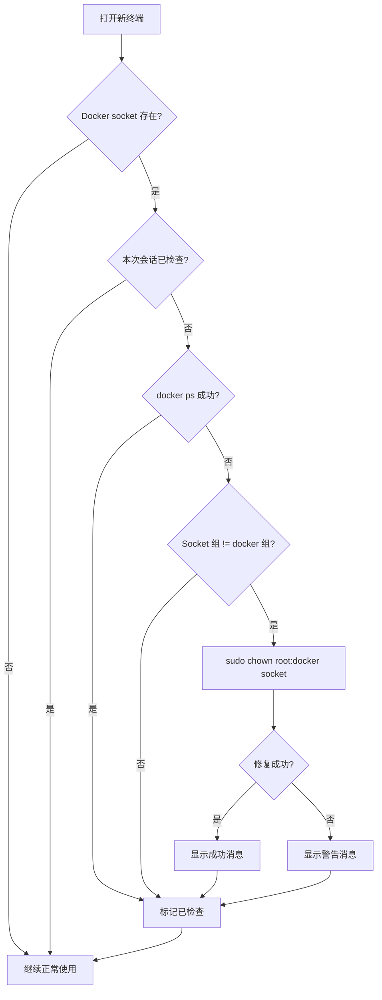

# Docker 权限修复方案

## 问题描述

在使用 SWE-agent 的 Harmony MAS 系统时，可能会遇到 Docker 权限错误：
```
permission denied while trying to connect to the Docker daemon socket
```

这是因为 Docker socket 的组权限可能与 `docker` 用户组不匹配。

## 长期解决方案

本项目已实现**三层自动修复机制**，确保 Docker 权限问题得到永久解决：

### 1. 容器创建时自动修复 (`postcreate.sh`)

在 devcontainer 创建后，`.devcontainer/postcreate.sh` 会自动运行权限修复脚本。

### 2. Shell 启动时自动检查 (`bashrc_epilog.sh`)

每次打开新的终端时，`.devcontainer/bashrc_epilog.sh` 会：
- 检测 Docker 权限是否正确
- 如果有问题，自动修复（需要 passwordless sudo）
- 每个 shell 会话只检查一次（通过环境变量 `DOCKER_PERMS_CHECKED`）

### 3. 手动修复脚本 (`fix_docker_permissions.sh`)

如果需要手动修复，运行：
```bash
./.devcontainer/fix_docker_permissions.sh
```

该脚本会：
- ✅ 检查 Docker socket 是否存在
- ✅ 验证用户是否在 docker 组中
- ✅ 修复 socket 的组所有权
- ✅ 测试 Docker 访问是否正常

## 工作原理

### 权限检查流程



### 实现细节

**bashrc_epilog.sh** 中的关键代码：
```bash
# 只在会话中检查一次
if [ -S "/var/run/docker.sock" ] && [ -z "$DOCKER_PERMS_CHECKED" ]; then
    if ! docker ps >/dev/null 2>&1; then
        # 获取当前 socket 组和 docker 组
        SOCKET_GID=$(stat -c '%g' /var/run/docker.sock)
        DOCKER_GID=$(getent group docker | cut -d: -f3)

        # 如果不匹配，尝试修复
        if [ "$SOCKET_GID" != "$DOCKER_GID" ]; then
            sudo -n chown root:docker /var/run/docker.sock
        fi
    fi
    export DOCKER_PERMS_CHECKED=1
fi
```

## 手动修复（如果自动修复失败）

如果自动修复不起作用，手动执行以下命令：

```bash
# 1. 确认 Docker socket 组权限
ls -la /var/run/docker.sock

# 2. 修复组所有权
sudo chown root:docker /var/run/docker.sock

# 3. 验证修复
docker ps

# 4. （可选）确保用户在 docker 组中
sudo usermod -aG docker $USER
# 注意：添加用户到组后需要重新登录才能生效
```

## 故障排除

### 问题：每次打开新终端都需要手动修复

**原因**：Docker socket 权限在系统重启或 Docker 服务重启后会重置。

**解决方案**：
- 自动修复已集成到 `bashrc_epilog.sh`，会在每个新 shell 中自动检查
- 确保你有 passwordless sudo 权限（devcontainer 默认配置）

### 问题：sudo 需要密码

**原因**：某些环境可能需要密码才能执行 sudo。

**解决方案**：
```bash
# 配置 passwordless sudo（仅用于 docker socket）
echo "$USER ALL=(ALL) NOPASSWD: /bin/chown root\:docker /var/run/docker.sock" | sudo tee /etc/sudoers.d/docker-socket
```

### 问题：修复后仍然无法访问 Docker

**可能原因**：
1. 用户不在 docker 组中
2. 需要重新登录以刷新组成员身份
3. Docker 服务未运行

**检查步骤**：
```bash
# 1. 检查用户组
groups | grep docker

# 2. 检查 Docker 服务
sudo systemctl status docker

# 3. 检查 socket 权限
ls -la /var/run/docker.sock
```

## 性能影响

- **启动时间**：每个新 shell 增加约 10-50ms（仅在首次检测到问题时）
- **会话变量**：使用 `DOCKER_PERMS_CHECKED` 确保每个会话只检查一次
- **静默模式**：如果权限正常，不会有任何输出

## 总结

✅ **自动化**：三层自动修复，无需人工干预
✅ **高效**：每个 shell 会话只检查一次
✅ **透明**：权限正常时无感知
✅ **健壮**：即使自动修复失败也提供手动方案

---

**相关文件**：
- `.devcontainer/fix_docker_permissions.sh` - 独立修复脚本
- `.devcontainer/postcreate.sh` - 容器创建时执行
- `.devcontainer/bashrc_epilog.sh` - Shell 启动时执行
